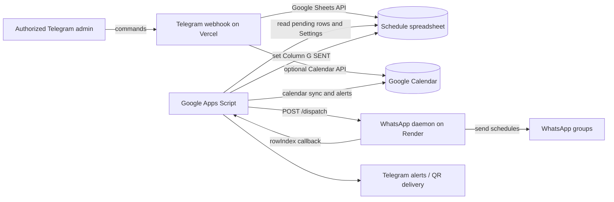

# TCR Classes Scheduling System — Operations Runbook

This repository contains the operational documentation and WhatsApp dispatch bot for the TCR class schedule. It also contains the separately deployed Telegram schedule-management webhook under [`telegram/`](telegram/). The Telegram app runs independently on Vercel; the WhatsApp bot runs as a persistent Node.js service. Google Sheets is the shared schedule store, and the Google Apps Script (GAS) below connects the sheet, calendar, and WhatsApp dispatcher.

This runbook is written for an operator taking over the system. It describes the current code and the GAS script supplied for this deployment; it is not a claim that the live Render settings, spreadsheet, Apps Script deployment, or triggers have been independently inspected. Replace every `YOUR_...` placeholder with the actual value from the appropriate provider. **Never put tokens, private keys, QR/session files, service-account JSON, or webhook secrets in this repository.**

## 1. System overview



### What runs where

| Component | Source | Runtime / deploy root | Responsibility |
| --- | --- | --- | --- |
| WhatsApp dispatcher | This repository, root `index.js` | Render web service; `Procfile` starts `node index.js` | Keeps a Baileys WhatsApp Web connection open, fetches pending schedule rows through GAS, creates Zoom links when configured, sends schedule bundles to mapped WhatsApp groups, then posts row acknowledgements to GAS. |
| Telegram schedule manager | This repository, `telegram/` | Vercel project `tcr-telegram-scheduler-bot`, root directory `telegram`, production branch `main` | Authorized admin commands to check, list, create, update, and delete schedule rows. `/create` may also create a Calendar event. This is not the WhatsApp group dispatcher. |
| Google Apps Script | Script attached to the schedule spreadsheet | Google Apps Script Web App plus manually installed/time-driven triggers | Exposes pending rows and WhatsApp group settings to the Render bot, marks acknowledged rows `SENT`, syncs calendar events, triggers dispatch, and sends operational Telegram alerts. |
| Schedule data | Google spreadsheet | Google Sheets | Shared data contract for the three components. |
| Optional Zoom integration | Zoom Server-to-Server OAuth app | Called by Render bot | Creates meeting links for configured centers. |

### Message-sending ownership: what does and does not send announcements

Avoid saying that every component “sends schedule announcements”; they do different jobs:

* **WhatsApp group schedule announcements:** `index.js` / the Render daemon is the only component in this repository that sends the scheduled class bundle to WhatsApp groups. It selects rows that GAS returns as not `SENT`, groups them by center/course, and sends them to the group JIDs in the spreadsheet’s `Settings` tab.
* **Telegram schedule-management bot:** the Vercel app sends command replies to the administrator who invoked `/check`, `/list`, `/create`, `/update`, `/delete`, or `/reauth`. It does **not** broadcast class schedules to Telegram groups/channels.
* **GAS in the code below:** does calendar synchronization, calls Render `/dispatch`, marks rows `SENT` after Render’s callback, and sends errors/QR-related alerts. Its `/check` handler replies to the Telegram chat that sent the command. It does **not** broadcast schedule announcements to Telegram channels.

Thus, with the code documented here, the two bots are not both announcing the same class to Telegram audiences. The important shared-state hazard is **Column G (`SENT`)**: Render considers a row complete after a successful send to *at least one* target group. If a class routes to multiple groups and one send fails while another succeeds, the bot still acknowledges all bundled rows to GAS; GAS marks them `SENT`, and the failed group will not get an automatic retry. A later operator edit can clear the status and requeue the row, but may resend it to groups that already received it. Before changing dispatch semantics, consider replacing the single global status with per-destination delivery tracking and idempotency; that is a behavior change and is not implemented here.

## 2. Repository and deployment map

* GitHub repository: `iTzDeb/tcr-classes-whatsapp-bot`
* Production branch: `main`
* Render service: use the service’s actual Dashboard URL; the repository has historically used different Render hostnames in different places. Confirm the live service domain rather than assuming an old URL remains valid.
* Vercel project: `tcr-telegram-scheduler-bot` under the `deb-4379` team/account; root directory **`telegram`**; production branch **`main`**.
* Stable Telegram production URL: `https://tcr-telegram-scheduler-bot.vercel.app/`

The Vercel project uses the repository’s `telegram/vercel.json`. Do not set its root to the repository root: that would deploy the wrong app. The Vercel project can auto-deploy `main`; the Render project should also be connected to this repository/root as its service configuration requires. Never deploy or relink a project until you have checked its repository, branch, root directory, environment variables, and production domain.

## 3. Shared Google Sheet contract

The schedule tab is named **`Schedule`**. Rows begin at row 2; row 1 is the header. The WhatsApp GAS code uses columns A–H:

| Column | Field | Meaning / writer |
| --- | --- | --- |
| A | Date | Class date. Required. |
| B | Time | Class time range, for example `10:00 AM - 12:00 PM`. Required. |
| C | Center | Class center; used in message grouping and routing. Required. |
| D | Course | Course/batch; used in message grouping and routing. Required. |
| E | Subject | Subject. Required. |
| F | Faculty | Faculty. Required. |
| G | Status | Empty/non-`SENT` means pending for the WhatsApp dispatcher. `SENT` means GAS received a Render acknowledgement. Telegram `/update` clears this status when class details change; an operator may also edit it manually. |
| H | Calendar event ID | GAS calendar sync stores `CalendarEvent.getId()`. The Telegram app currently stores Google Calendar API `iCalUID` on create. Confirm that these identifiers work with the specific GAS calendar operation before relying on cross-app updates/deletes; test with a copy of the sheet/calendar first. |

The **`Settings`** tab contains rows mapping Center (A), Course (B), and one or more comma-separated WhatsApp group JIDs (C). The key is normalized by the dispatcher to `center_course`, e.g. `laxmi nagar_gs foundation`. Verify spelling and JIDs carefully: a missing mapping prevents delivery for that group.

The Vercel Telegram app writes schedule rows directly through the Google Sheets API. Those API edits **do not fire Apps Script `onEdit` triggers**. If new Telegram-created rows need calendar synchronization, use a time-driven GAS reconciliation or have the Telegram app perform calendar sync (the current `/create` path attempts the latter). `autoTriggerCalendarSync(e)` only runs for human edits when installed as an edit trigger.

## 4. Data ownership and operational rules

1. **GAS owns the Render acknowledgement path.** Render posts `{ "rowIndex": n }` to the GAS web app; GAS writes `SENT` into G. Do not mark rows `SENT` manually until the intended destination delivery has been confirmed.
2. **The Telegram manager owns admin CRUD requests, not group delivery.** Its `/create` and `/update` operations can clear G so a row is eligible for WhatsApp dispatch. `/delete` removes the row. Always verify a row’s date and time before changing it.
3. **Calendar writes have two paths.** GAS `syncToCalendar()` and `autoTriggerCalendarSync(e)` create/update/delete events using `CalendarApp`; Telegram `/create` uses the Google Calendar API. Avoid running multiple independent “create missing events” routines without checking Column H and matching identifiers.
4. **Manual recovery can duplicate messages.** To retry a missed WhatsApp group, inspect all configured recipient groups first. The status is per row, not per group. Clear G only after deciding which groups need a resend.
5. **Do not run dispatch concurrently.** Render rejects a second `/dispatch` with HTTP 429 while processing. A not-connected socket returns HTTP 503. A `200` from `/dispatch` means the request was accepted, not necessarily that every class reached every group; inspect Render logs and the sheet.

## 5. Vercel Telegram bot runbook

### Commands

| Command | Effect |
| --- | --- |
| `/start`, `/help` | Show help. |
| `/check` | Read the sheet and count rows with a date and status other than `SENT`. This confirms the bot responded and can read the schedule. |
| `/list` | Show schedule rows. |
| `/list <date or text>` | Filter by a date, center, course, subject, faculty, or keyword. |
| `/create <class details>` or `/add <class details>` | Add a complete row in chronological order using an explicit A:H range, leaving G empty and storing the Calendar `iCalUID` in H. The entered class date/time is interpreted as Asia/Kolkata (IST) for Calendar creation. |
| `/update <row> <field> <value>` | Update one field. Supported fields: Date, Time, Center, Course, Subject, Faculty, Status. Changing a detail field clears G for redispatch. |
| `/update <row> <full row>` | Update A–G for a complete class. It clears G and leaves H untouched. Review calendar consistency after changing class date/time/details. |
| `/delete <row>` | Delete the linked Calendar event in H, then permanently delete the schedule row. If Calendar deletion fails, the row is kept. If H is empty or the event is already gone, the bot reports that and deletes the row. |
| `/reauth` | Show WhatsApp relinking instructions. This Telegram command does not currently call Render or force a new QR code. |

The supplied `/check` smoke test has already been confirmed by the owner. It tests Telegram delivery, webhook execution, and basic Sheets access; it does not prove writes, Calendar access, GAS triggers, Render dispatch, or WhatsApp delivery.

The Telegram `/start` and `/help` commands also register the Telegram command menu, including `/help`, using Bot API `setMyCommands`. Command failures are reported in the chat with a safe error summary and a reference ID for matching Vercel function logs. If Calendar creation fails during `/create`, the bot clearly reports that the schedule row was saved without an event. Calendar/Sheets failures during `/delete` stop the deletion when the event could not be removed, to avoid leaving an orphaned event.

`/reauth` currently only returns instructions; it does not verify WhatsApp's live connection status or trigger the Render daemon. Do not treat its reply as confirmation that a QR was generated or delivered.

**Important:** deleting a row directly in Google Sheets does not call the Telegram bot and cannot automatically remove its Calendar event. Use Telegram `/delete <row>` for linked cleanup. Before deleting a row, check that its row number is current and that H contains the intended event identifier.

### Repairing rows created by the old append bug

In the reported `/create`, the new class record was written on row 112, but its fields started in column H instead of column A. The earlier implementation used `values.append` with the A:H range; Google Sheets table detection can append after the last populated column in the detected table. The current implementation avoids append/table detection: it inserts the selected row and writes an explicit `A<row>:H<row>` range. This prevents future records from shifting right; it does not move the already-created row automatically.

To repair the newly-created shifted entry:

1. Make a copy of the spreadsheet before editing, and inspect the affected row and its Calendar event.
2. On that row, copy the six class fields (date, time, center, course, subject, faculty) from their shifted cells (H:M in the screenshot) into **A:F**.
3. Keep **G** blank unless dispatch is confirmed complete. Identify the Calendar event ID separately; put it in **H** only if it is the correct identifier type for the workflows using it. Do not mistake the shifted date for the event ID or overwrite another value.
4. Check the row appears correctly with `/list`, then verify its event in the calendar. The Calendar event shown for this entry is also 5h30 later than the requested time; correct that event to the intended IST time after checking its date and details.
5. Clear the shifted copy of the six class fields only after verifying the repaired A:H values and safely preserving any event identifier. Confirm those cells do not belong to another row/data table. If uncertain, leave extra cells untouched and ask the spreadsheet owner to review.

### Required Vercel environment variables

Set values in **Vercel Project → Settings → Environment Variables**, not in Git:

| Variable | Required | Notes |
| --- | --- | --- |
| `TELEGRAM_BOT_TOKEN` | Yes | Current token from Telegram BotFather. |
| `TELEGRAM_WEBHOOK_SECRET` | Yes | Random 1–256 character secret consisting of letters, numbers, `_`, or `-`. Telegram sends it in `X-Telegram-Bot-Api-Secret-Token`. The code uses a timing-safe comparison. |
| `AUTHORIZED_CHAT_ID` | Yes | User or chat ID authorized to issue commands. For least privilege, use the administrator’s private-chat user ID. |
| `SPREADSHEET_ID` | Yes | Google spreadsheet ID. |
| `GOOGLE_SERVICE_ACCOUNT_KEY` | Yes | Service account JSON, raw or base64-encoded. Keep it secret. |
| `GOOGLE_CALENDAR_ID` | No | Calendar ID; code defaults to `primary`. Configure if the service account can write to that calendar. |

The code rejects POST requests with missing configuration or an invalid Telegram secret. The production endpoint must be reachable by Telegram. If Vercel Deployment Protection is enabled for the webhook URL, use Vercel’s documented automation-bypass mechanism and include the bypass query parameter in Telegram’s configured webhook URL; **do not paste the bypass secret into this README or a public issue**. The Telegram-specific secret check remains required even when Vercel protection is configured.

### Vercel deploy / redeploy

1. Confirm the changes are merged to `main` and the Vercel project still points to `iTzDeb/tcr-classes-whatsapp-bot`, root `telegram`, and production branch `main`.
2. Check that all required Production environment variable *names* exist. Vercel hides secret values; don’t pull secrets into a shared or repository-local file.
3. Let the Git integration deploy from `main`, or, from the repository root with Vercel CLI authenticated to the correct account, run:

   ```powershell
   vercel deploy . --prod --project tcr-telegram-scheduler-bot --yes
   ```

   The `.` is intentional: with project root configured as `telegram`, deploying from within `telegram/` may make the CLI look for a nested `telegram/telegram` root. Verify the Vercel CLI message says the project’s configured root exists and the build routes `api/index.js`.
4. Wait until the deployment status is **Ready**. Confirm production alias is `https://tcr-telegram-scheduler-bot.vercel.app/`.
5. Check `GET /` for the health message; check Telegram `getWebhookInfo` for the expected webhook URL, zero/declining pending updates, and no `last_error_message`.
6. Test `/check` and `/list` in the authorized private chat. For writes, use a copied spreadsheet and a non-production test deployment where possible.

From the Telegram app directory, local checks are:

```powershell
npm ci
npm test
```

The tests cover parsing, filtering, insertion order, configuration validation, and webhook-secret checks; they do not write to live Google services or send messages.

### Configure/recover Telegram’s webhook

Telegram’s `setWebhook` request needs the public production URL and the same `TELEGRAM_WEBHOOK_SECRET` configured in Vercel. Do not put a real token or secret in command history or documentation. Prefer a password manager or a short-lived private script/input file, then securely remove it.

Template only:

```text
POST https://api.telegram.org/bot<TELEGRAM_BOT_TOKEN>/setWebhook
JSON body:
{
  "url": "https://tcr-telegram-scheduler-bot.vercel.app/",
  "secret_token": "<TELEGRAM_WEBHOOK_SECRET>",
  "allowed_updates": ["message"],
  "drop_pending_updates": false
}
```

Inspect status using `getWebhookInfo` for the same bot token. If a token is rotated, update Vercel Production (and Preview if used), redeploy, then re-register the webhook. If the endpoint URL or Vercel protection configuration changes, update `setWebhook` and verify delivery again. Do not call `deleteWebhook` or set `drop_pending_updates: true` unless you deliberately intend to discard queued updates.

## 6. Google Cloud and service-account handover

The Vercel Telegram app uses a Google service account. A new operator should:

1. Use a Google Cloud project controlled by the organization, not an individual’s personal account.
2. Enable **Google Sheets API**. Enable **Google Calendar API** if Telegram `/create` should make calendar events.
3. Create a service account with the minimum practical project permissions. Generate its JSON key only if using `GOOGLE_SERVICE_ACCOUNT_KEY`; store it in an approved password manager and Vercel secret settings.
4. Share the schedule spreadsheet with the service-account email as **Editor**.
5. If calendar integration is enabled, share the target calendar with the same account and grant event-edit permission. Calendar API access and Sheet access are separate permissions.
6. Verify the configured `SPREADSHEET_ID`, schedule tab name, `GOOGLE_CALENDAR_ID`, and Column H event-ID behavior with a test spreadsheet/calendar before a production write.
7. Revoke old service-account keys after a replacement is verified. Do not attach JSON keys to issues, commits, or chat.

GAS runs under the Google account that owns/deploys the script, not the Vercel service account. Ensure the GAS owner retains spreadsheet/calendar permissions and that Apps Script OAuth scopes have been authorized after code changes.

## 7. Render WhatsApp bot runbook

### Required/optional environment variables

| Variable | Required | Notes |
| --- | --- | --- |
| `PORT` | Usually supplied by host | Express port; defaults to 8080. |
| `ZOOM_ACCOUNT_ID` | Optional | Zoom Server-to-Server OAuth account ID. |
| `ZOOM_CLIENT_ID` | Optional | Zoom OAuth client ID. |
| `ZOOM_CLIENT_SECRET` | Optional | Zoom OAuth client secret. |
| `TELEGRAM_BOT_TOKEN` | Optional for alerts | Used for alerts and QR delivery from the Render bot. |
| `TELEGRAM_CHAT_ID` | Optional for alerts | Recipient for Render alerts and login QR. |

`CONFIG.APPS_SCRIPT_URL` is currently a literal in `index.js` and must be the deployed Apps Script Web App `/exec` URL. The Render host URL is also referenced by the GAS trigger and keep-alive functions; update both GAS properties/settings when the Render service hostname changes. Never commit a new Apps Script URL if your deployment treats it as an access secret.

### Deploy

The repository’s `Procfile` runs `node index.js`; `package.json` declares an ES module app. In the Render service, verify:

* It is a **Web Service** deployed from this repository and intended branch.
* Build/install command installs the root `package.json` dependencies; start command is `node index.js` (or uses the repository `Procfile`).
* Required Zoom/Telegram environment values are set in Render’s secret settings.
* Persistent disk or equivalent storage is enabled for `auth_info/` if the host supports it and the WhatsApp session must survive restarts. `auth_info/` is credentials and must never be committed or downloaded to shared storage.
* The Render service’s actual public URL is reflected in GAS dispatch and health URLs.
* Host plan behavior is understood: a free/idle service may sleep, restart, or have resource limits. A persistent WhatsApp WebSocket needs an always-running process, so “free” hosting is not guaranteed to be uninterrupted.

### Endpoints and status

| Endpoint | Purpose |
| --- | --- |
| `GET /` | Returns a short status message; use it as a simple Render health check. |
| `GET /status` | JSON connection status, processing flag, and timestamp. |
| `POST /dispatch` | Starts dispatch if WhatsApp is connected and no dispatch is already running. |
| `POST /reauth` | If connected, reports that it is already connected; otherwise sends a Telegram alert. It does not reset saved credentials, restart the socket, or guarantee a QR code. |

A response `200` from `/dispatch` means accepted/started; `503` means the WhatsApp socket is unavailable; `429` means another dispatch is already running. Review service logs and actual destination groups for delivery confirmation.

The GitHub Actions dispatcher prints the immediate HTTP status and response body and fails the run for non-`200` responses. A `200` confirms only that Render accepted the request; schedule fetching and WhatsApp sends run asynchronously, so check Render logs and Telegram alerts for their result. On an Apps Script fetch failure, the daemon logs the request URL, status/code, response details, timestamp, and error reference; the generic HTTP error alone does not identify the cause.

### WhatsApp relink / recovery

1. Inspect Render logs and `GET /status`. Confirm whether the connection is logged out or merely reconnecting. `/reauth` in Telegram only displays instructions; `POST /reauth` on Render sends an alert when disconnected but does not reset the session or guarantee a QR.
2. When Baileys emits a QR, the daemon attempts to send it to the configured Telegram alert chat. Open WhatsApp on the account that owns the linked device → **Linked devices** → **Link a device**, then scan the fresh QR promptly. The QR-image delivery currently uses an external QR rendering service; do not treat QR payloads as non-sensitive.
3. If the account is logged out and no QR is emitted, the current `/reauth` paths do not initiate a new pairing session. Check Render Telegram environment variables and logs and use the service’s secure operational recovery procedure; do not assume that calling `/reauth` repairs the session.
4. Do not copy `auth_info/` into Git, send it through chat, or share it with a new operator. If it is exposed, revoke the linked device from the WhatsApp phone and create a fresh link.
5. Verify the daemon reports connected before dispatching. Use `/status`; send a controlled test to a designated test group before resuming production sends.

The socket sets `markOnlineOnConnect: false` so it does not mark the linked device available on connect. This is intended to let the primary phone continue receiving notifications; it does not eliminate every possible WhatsApp encryption/history-sync issue.

### WhatsApp group mapping

`node getgroups.js` can print group JIDs after the project has a valid WhatsApp session. Treat JIDs as operational data. Add mappings in the Google Sheet `Settings` tab with Center, Course, and comma-separated group JIDs. Send a test only to a test group before updating production routing.

## 8. Google Apps Script deployment and triggers

### Install/update GAS

1. Open the schedule spreadsheet with an account that is an owner/editor and open **Extensions → Apps Script**.
2. Back up the currently deployed script/version before replacing code. Paste the complete template from §10, then save.
3. In **Project Settings → Script Properties**, set the required properties listed below. Do not store secrets in source code.
4. In **Project Settings**, set the script timezone to the schedule’s intended timezone (the code uses local `Date`/`setHours` in places). For this schedule, confirm whether it should be `Asia/Kolkata`.
5. Deploy → **New deployment** → **Web app**. Execute as the spreadsheet/script owner. Select the access policy that allows the Render service to call the web app. If that requires public/anonymous access, treat the `/exec` URL as sensitive: the supplied GAS code has no request authentication and its endpoints expose pending schedule/group data and accept row acknowledgements.
6. Copy the deployed `/exec` URL into `APPS_SCRIPT_URL` in `index.js`, commit/review/deploy the Render app, and update the GAS Script Property `RENDER_DISPATCH_URL` with the actual Render host. Do not use the Apps Script test `/dev` URL for production.
7. Authorize Calendar/Spreadsheet/UrlFetch scopes when prompted. Test `GET /exec` returns valid JSON containing `classes` and `settings`; test a callback only against a copied sheet before production use.
8. Whenever code changes, create a new GAS deployment version and confirm the `/exec` deployment points to that version.

### GAS Script Properties

Set these in **Apps Script → Project Settings → Script Properties**:

| Property | Required | Purpose |
| --- | --- | --- |
| `CALENDAR_ID` | Yes | Calendar ID used by `CalendarApp`. |
| `TELEGRAM_BOT_TOKEN` | For Telegram alerts/`/check` | Telegram bot token used by this GAS project. |
| `TELEGRAM_CHAT_ID` | For outbound alerts | Chat ID used by `sendTelegramAlert`; `/check` replies to the inbound chat. |
| `RENDER_DISPATCH_URL` | Yes | Full Render URL ending in `/dispatch`. |
| `RENDER_HEALTH_URL` | Optional | Render service base URL used by `keepBotAlive`. |

The GAS script’s `GITHUB_TOKEN`, `GITHUB_REPO`, and `WORKFLOW_FILENAME` declarations from the supplied paste were not used by any function in that script and are intentionally omitted from this published runbook template. If another private script version uses GitHub API calls, configure its GitHub credential in Script Properties and rotate any credential that has ever been pasted into a document or chat.

### Trigger behavior—verify before relying on it

* `autoTriggerCalendarSync(e)` must be installed as an **on-edit installable trigger** if manual spreadsheet edits should sync calendar events. Simple edit triggers may not have authorization for all services; use the installable trigger.
* Telegram writes through the Sheets API do not fire `onEdit`. GAS time-driven reconciliation is needed if such rows require GAS-side calendar work.
* `armDailyTrigger()` deletes existing triggers for `triggerBotExactlyOnTime`, then schedules **one** execution at 16:26 in the script’s timezone (or tomorrow if that time passed). It does **not** schedule itself again. Re-run it after every execution, or replace it with a reviewed recurring daily trigger. Do not assume it is a repeating trigger.
* `keepBotAlive()` does nothing unless a time-driven trigger is installed. A keep-alive ping does not guarantee Render free-tier availability or an always-on connection.
* `syncToCalendar()` and `cleanupOldSentEvents()` are not scheduled by this code. Install a trigger only after confirming the intended behavior and safe test data.
* `cleanupOldSentEvents()` deletes calendar events for past `SENT` rows that match the subject. It does not delete rows. Test carefully and only schedule if this deletion policy is intended.

Create/manage triggers in Apps Script → **Triggers** (alarm-clock icon). Use one trigger per desired function; remove obsolete triggers explicitly after checking their handlers.

## 9. Troubleshooting

| Symptom | Checks |
| --- | --- |
| Telegram bot does not respond | Vercel production deployment is Ready; project root is `telegram`; `GET /` returns health; Telegram `getWebhookInfo` URL matches stable domain and has no delivery error; `TELEGRAM_BOT_TOKEN`, `TELEGRAM_WEBHOOK_SECRET`, `AUTHORIZED_CHAT_ID` are correct; webhook secret sent by Telegram matches Vercel. Review Vercel function logs. |
| Telegram says access denied | Confirm `AUTHORIZED_CHAT_ID` matches the expected Telegram private chat or user ID. Avoid using a group ID unless group access is intentional. |
| `/check` works but schedule is empty | Confirm `SPREADSHEET_ID`, tab name `Schedule`, row 1 headers, rows have dates in A, and service account has Editor access. `/check` counts only dated rows not marked `SENT`. |
| Telegram `/create` fails | Confirm full six fields (date, time, center, course, subject, faculty), Sheets API is enabled, service account has sheet Editor access, and chronological date/time formats are parseable. Test in a copy. |
| Telegram `/create` row exists but Calendar event is missing | Check Vercel logs, `GOOGLE_CALENDAR_ID`, Calendar API enablement, service-account calendar sharing, and event-ID format in H. The handler can still create the row when Calendar sync returns no event. |
| New Telegram row starts in column H or later | Update/redeploy the Telegram app with the explicit row insert/write fix. For an existing shifted row, use the repair procedure above; the code fix does not move old cells. |
| Telegram-created Calendar event is 5h30 later than requested | The old API code treated the entered IST wall time as UTC. The current code converts IST to a UTC instant before creating events. Correct old events manually or update them through Calendar after checking the intended date/time; redeploy alone does not modify existing events. |
| Calendar duplicates or stale events | Compare Column H with the calendar event ID expected by the code. Telegram `/delete` searches by `iCalUID` and falls back to deleting by event ID, supporting Telegram- and GAS-created references. Validate with a test calendar and confirm times in the Asia/Kolkata calendar timezone. Deleting directly in Sheets does not remove Calendar events. |
| Render reports no schedule | Check Apps Script Web App `/exec` returns `{classes, settings}`; GAS deployment version; Render’s `APPS_SCRIPT_URL`; tomorrow/date timezone calculations; and Column G status. |
| Render reports an Apps Script 404 | Check the `APPS_SCRIPT_URL` printed in Render logs, confirm it is the deployed Web App `/exec` URL (not `/dev`), and inspect the response details and active Apps Script deployment. |
| Render `/dispatch` returns 503 | Check Render is running and `/status` says `whatsappConnected: true`; inspect Baileys reconnect/auth logs and relink if logged out. |
| Render `/dispatch` returns 429 | A prior dispatch is still processing. Wait and inspect logs before retrying; do not start another send in parallel. |
| A group did not receive a message but row says SENT | Current acknowledgement is row-wide: one successful recipient can cause all session rows to be marked `SENT`, even if another recipient failed. Check logs/group JIDs and manually coordinate a targeted resend to avoid duplicating groups already served. |
| GAS Calendar sync does not run after Telegram edit | Expected: Sheets API edits do not invoke Apps Script `onEdit`; use a deliberate time-driven sync/reconciliation. |
| Trigger fires at unexpected time or only once | Check Apps Script timezone. `armDailyTrigger()` schedules one one-shot run at 16:26 and must be rearmed. |
| Render repeatedly restarts or sleeps | Review Render plan/service events, memory, session storage persistence, outbound connectivity, and host sleep policy. Free service plans may not support a persistent daemon. |

## 10. Google Apps Script code template (credentials removed)

This is the complete Apps Script pasted for this deployment, with credentials and deployment-specific identifiers replaced by Script Properties/placeholders. It intentionally omits the unused GitHub configuration declarations described above. Configure the properties in §8 before deploying. **This code is a template for documentation; updating this README does not update the live Apps Script project.**

```javascript
// =========================================================================
// GLOBAL CONFIGURATION — set values in Apps Script Script Properties.
// =========================================================================
const SCRIPT_PROPERTIES = PropertiesService.getScriptProperties();
const CALENDAR_ID = SCRIPT_PROPERTIES.getProperty('CALENDAR_ID') || 'YOUR_GOOGLE_CALENDAR_ID';
const TELEGRAM_BOT_TOKEN = SCRIPT_PROPERTIES.getProperty('TELEGRAM_BOT_TOKEN') || 'SET_IN_SCRIPT_PROPERTIES';
const TELEGRAM_CHAT_ID = SCRIPT_PROPERTIES.getProperty('TELEGRAM_CHAT_ID') || 'SET_IN_SCRIPT_PROPERTIES';
const RENDER_DISPATCH_URL = SCRIPT_PROPERTIES.getProperty('RENDER_DISPATCH_URL') || 'https://YOUR-RENDER-SERVICE.onrender.com/dispatch';
const RENDER_HEALTH_URL = SCRIPT_PROPERTIES.getProperty('RENDER_HEALTH_URL') || 'https://YOUR-RENDER-SERVICE.onrender.com';

// =========================================================================
// TELEGRAM NOTIFICATION ENGINE
// =========================================================================
function sendTelegramAlert(message) {
  const url = `https://api.telegram.org/bot${TELEGRAM_BOT_TOKEN}/sendMessage`;
  const options = {
    method: 'post',
    contentType: 'application/json',
    muteHttpExceptions: true,
    payload: JSON.stringify({
      chat_id: TELEGRAM_CHAT_ID,
      text: `🚨 *TCR Bot Alert*\n\n${message}`,
      parse_mode: 'Markdown'
    })
  };
  try {
    UrlFetchApp.fetch(url, options);
  } catch (e) {
    console.error("Failed to send Telegram alert: " + e.message);
  }
}

// =========================================================================
// API ENDPOINTS (NODE.JS & TELEGRAM INBOUND)
// =========================================================================
function doGet(e) {
  const ss = SpreadsheetApp.getActiveSpreadsheet();
  const scheduleSheet = ss.getSheets()[0];
  const scheduleData = scheduleSheet.getDataRange().getValues();
  const classes = [];

  for (let i = 1; i < scheduleData.length; i++) {
    const row = scheduleData[i];
    const status = String(row[6] || '').trim(); // Column G

    if (!row[0] || status === 'SENT') continue;

    let zoomStart = null;
    let zoomDuration = 120;
    const parsedTimes = parseStartEndTimes(row[0], String(row[1]));

    if (parsedTimes) {
      zoomStart = parsedTimes.start.toISOString();
      zoomDuration = Math.round((parsedTimes.end.getTime() - parsedTimes.start.getTime()) / 60000);
    }

    classes.push({
      rowIndex: i + 1,
      date: row[0],
      time: String(row[1]),
      center: String(row[2]),
      course: String(row[3]),
      subject: String(row[4]),
      faculty: String(row[5]),
      zoomStart: zoomStart,
      zoomDuration: zoomDuration
    });
  }

  const settingsSheet = ss.getSheetByName('Settings');
  const settings = {};

  if (settingsSheet) {
    const settingsData = settingsSheet.getDataRange().getValues();
    for (let i = 1; i < settingsData.length; i++) {
      const center = String(settingsData[i][0]).trim();
      const course = String(settingsData[i][1]).trim();
      const groupId = String(settingsData[i][2]).trim();

      if (center && course && groupId) {
        settings[`${center}_${course}`] = groupId;
      }
    }
  }

  return ContentService.createTextOutput(JSON.stringify({ classes: classes, settings: settings }))
    .setMimeType(ContentService.MimeType.JSON);
}

function doPost(e) {
  try {
    if (!e || !e.postData || !e.postData.contents) return HtmlService.createHtmlOutput("OK");
    const payload = JSON.parse(e.postData.contents);

    // ROUTE 1: Incoming from Node.js
    if (payload.rowIndex) {
      const ss = SpreadsheetApp.getActiveSpreadsheet();
      const sheet = ss.getSheets()[0];
      sheet.getRange(payload.rowIndex, 7).setValue('SENT');
      return ContentService.createTextOutput(JSON.stringify({ success: true }))
        .setMimeType(ContentService.MimeType.JSON);
    }

    // ROUTE 2: Incoming Webhook from Telegram
    if (payload.message && payload.message.text) {
      const text = payload.message.text.trim();
      const incomingChatId = payload.message.chat.id;

      if (text === '/check') {
        const sheet = SpreadsheetApp.getActiveSpreadsheet().getSheetByName('Schedule');
        const data = sheet.getDataRange().getValues();
        let pendingCount = 0;

        for (let i = 1; i < data.length; i++) {
          if (data[i][0] && data[i][6] !== 'SENT') {
            pendingCount++;
          }
        }

        const msg = `📊 *TCR Class Scheduler Bot*\n *System is online.* There are *${pendingCount}* pending classes in the sheet waiting for dispatch.`;

        // Send message using a clean standalone helper function
        sendTelegramMessage(incomingChatId, msg);
      }
    }
  } catch (err) {
    console.error(err);
  }

  // Clean 200 OK return that stops Telegram loops instantly
  return HtmlService.createHtmlOutput("OK");
}

// Helper function to keep things modular and clean
function sendTelegramMessage(chatId, text) {
  const url = `https://api.telegram.org/bot${TELEGRAM_BOT_TOKEN}/sendMessage`;
  UrlFetchApp.fetch(url, {
    method: 'post',
    contentType: 'application/json',
    payload: JSON.stringify({
      chat_id: chatId,
      text: text,
      parse_mode: 'Markdown'
    })
  });
}

// =========================================================================
// CALENDAR SYNC FUNCTIONS
// =========================================================================
function syncToCalendar() {
  const sheet = SpreadsheetApp.getActiveSpreadsheet().getActiveSheet();
  const data = sheet.getDataRange().getValues();
  const calendar = CalendarApp.getCalendarById(CALENDAR_ID);

  if (!calendar) {
    sendTelegramAlert('Error: Calendar not found. Please check your CALENDAR_ID in the script properties.');
    return;
  }

  let skippedRows = [];

  for (let i = 1; i < data.length; i++) {
    const row = data[i];

    const dateObj = row[0];
    const timeStr = String(row[1]);
    const center = String(row[2]);
    const course = String(row[3]);
    const subject = String(row[4]);
    const faculty = String(row[5]);
    const eventId = String(row[7]);

    if (!dateObj || dateObj === 'undefined' || dateObj === '') continue;

    const eventTitle = `${course} - ${subject} (${faculty})`;
    const eventDesc = `Center: ${center}\nCourse: ${course}\nSubject: ${subject}\nFaculty: ${faculty}`;

    const parsedTimes = parseStartEndTimes(dateObj, timeStr);

    if (!parsedTimes) {
      skippedRows.push(i + 1);
      continue;
    }

    try {
      if (eventId && eventId !== 'undefined' && eventId !== '') {
        const event = calendar.getEventById(eventId);
        if (event) {
          event.setTitle(eventTitle);
          event.setDescription(eventDesc);
          event.setTime(parsedTimes.start, parsedTimes.end);
          event.setLocation(center);
        }
      } else {
        const newEvent = calendar.createEvent(eventTitle, parsedTimes.start, parsedTimes.end, {
          description: eventDesc,
          location: center
        });
        sheet.getRange(i + 1, 8).setValue(newEvent.getId());
      }

      // Pause for 1.5 seconds to prevent Google API rate limiting
      Utilities.sleep(1500);

    } catch (e) {
      console.error(`Error saving row ${i + 1}: ${e.message}`);

      if (e.message.includes('too many calendars')) {
        sendTelegramAlert(`Google API Rate Limit hit at row ${i + 1}. Please wait a few hours before running bulk sync again.`);
        break;
      }

      skippedRows.push(i + 1);
    }
  }

  if (skippedRows.length > 0) {
    sendTelegramAlert(`Sync finished, but could not understand the Date/Time format on row(s): *${skippedRows.join(', ')}*.\n\nPlease check the sheet for typos in the time column.`);
  }
}

function parseStartEndTimes(dateObj, timeStr) {
  try {
    const parts = String(timeStr).toUpperCase().split('-');
    if (parts.length !== 2) return null;

    let startStr = parts[0].trim();
    let endStr = parts[1].trim();

    let startMatch = startStr.match(/(\d+)(?::(\d+))?/);
    let endMatch = endStr.match(/(\d+)(?::(\d+))?/);

    if (!startMatch || !endMatch) return null;

    let startHours = parseInt(startMatch[1], 10);
    let startMins = startMatch[2] ? parseInt(startMatch[2], 10) : 0;
    let endHours = parseInt(endMatch[1], 10);
    let endMins = endMatch[2] ? parseInt(endMatch[2], 10) : 0;

    let startAmPm = startStr.includes('PM') ? 'PM' : (startStr.includes('AM') ? 'AM' : null);
    let endAmPm = endStr.includes('PM') ? 'PM' : (endStr.includes('AM') ? 'AM' : null);

    if (!startAmPm) {
      if (endAmPm === 'PM') {
        if (startHours >= 7 && startHours <= 11) startAmPm = 'AM';
        else startAmPm = 'PM';
      } else {
        startAmPm = 'AM';
      }
    }
    if (!endAmPm) endAmPm = 'PM';

    if (startAmPm === 'PM' && startHours !== 12) startHours += 12;
    if (startAmPm === 'AM' && startHours === 12) startHours = 0;

    if (endAmPm === 'PM' && endHours !== 12) endHours += 12;
    if (endAmPm === 'AM' && endHours === 12) endHours = 0;

    let startTime = new Date(dateObj);
    let endTime = new Date(dateObj);

    if (isNaN(startTime.getTime())) return null;

    startTime.setHours(startHours, startMins, 0, 0);
    endTime.setHours(endHours, endMins, 0, 0);

    return { start: startTime, end: endTime };
  } catch (e) {
    return null;
  }
}

// =========================================================================
// AUTOMATION TRIGGERS (Auto-Sync, Cleanup, Master Clock)
// =========================================================================
function triggerBotExactlyOnTime() {
  const options = {
    method: 'post',
    contentType: 'application/json',
    muteHttpExceptions: true
  };

  try {
    const response = UrlFetchApp.fetch(RENDER_DISPATCH_URL, options);
    console.log('Successfully triggered Render bot: ' + response.getContentText());
  } catch (e) {
    const errorMsg = 'Error triggering Render Action: ' + e.message;
    console.error(errorMsg);
    sendTelegramAlert(errorMsg);
  }
}

function autoTriggerCalendarSync(e) {
  if (!e || !e.range) return;
  const sheet = e.range.getSheet();
  const editedRow = e.range.getRow();

  if (sheet.getName() !== 'Schedule' || editedRow < 2) return;

  const rowValues = sheet.getRange(editedRow, 1, 1, 8).getValues()[0];
  const dateObj = rowValues[0];
  const isRowComplete = rowValues.slice(0, 6).every(cell => cell !== "" && cell !== null && cell !== undefined);
  const eventId = String(rowValues[7] || '').trim(); // Column H

  const calendar = CalendarApp.getCalendarById(CALENDAR_ID);
  if (!calendar) return;

  // SCENARIO 1: Row was cleared or emptied BUT has an existing Calendar Event ID -> Delete from Calendar
  if ((!isRowComplete || !dateObj) && eventId && eventId !== 'undefined') {
    try {
      const event = calendar.getEventById(eventId);
      if (event) {
        event.deleteEvent();
      }
      sheet.getRange(editedRow, 8).clearContent(); // Wipe the old ID from Column H
    } catch (err) {
      console.error(`Error deleting event for row ${editedRow}: ${err.message}`);
    }
    return;
  }

  // SCENARIO 2: Row is complete -> Create new event or Update existing one
  if (isRowComplete) {
    const timeStr = String(rowValues[1]);
    const center = String(rowValues[2]);
    const course = String(rowValues[3]);
    const subject = String(rowValues[4]);
    const faculty = String(rowValues[5]);

    const eventTitle = `${course} - ${subject} (${faculty})`;
    const eventDesc = `Center: ${center}\nCourse: ${course}\nSubject: ${subject}\nFaculty: ${faculty}`;
    const parsedTimes = parseStartEndTimes(dateObj, timeStr);

    if (!parsedTimes) return;

    try {
      if (eventId && eventId !== 'undefined') {
        const event = calendar.getEventById(eventId);
        if (event) {
          event.setTitle(eventTitle);
          event.setDescription(eventDesc);
          event.setTime(parsedTimes.start, parsedTimes.end);
          event.setLocation(center);
        }
      } else {
        const newEvent = calendar.createEvent(eventTitle, parsedTimes.start, parsedTimes.end, {
          description: eventDesc,
          location: center
        });
        sheet.getRange(editedRow, 8).setValue(newEvent.getId());
      }
    } catch (err) {
      console.error(`Error saving event for row ${editedRow}: ${err.message}`);
    }
  }
}

function cleanupOldSentEvents() {
  const sheet = SpreadsheetApp.getActiveSpreadsheet().getSheetByName('Schedule');
  if (!sheet) return;

  const data = sheet.getDataRange().getValues();
  const calendar = CalendarApp.getCalendarById(CALENDAR_ID);

  const today = new Date();
  today.setHours(0, 0, 0, 0);

  for (let i = data.length - 1; i >= 1; i--) {
    const row = data[i];
    const dateCell = row[0];
    const subject = String(row[4]);
    const statusCell = row[6];

    if (!dateCell) continue;

    const rowDate = new Date(dateCell);
    rowDate.setHours(0, 0, 0, 0);

    if (statusCell === 'SENT' && rowDate.getTime() < today.getTime()) {
      if (calendar) {
        const eventsOnDay = calendar.getEventsForDay(rowDate);
        for (const event of eventsOnDay) {
          if (event.getTitle().includes(subject)) {
            event.deleteEvent();
          }
        }
      }
      // sheet.deleteRow(i + 1);
    }
  }
}

function armDailyTrigger() {
  // 1. Delete ALL old triggers for 'triggerBotExactlyOnTime'.
  const triggers = ScriptApp.getProjectTriggers();
  for (const trigger of triggers) {
    if (trigger.getHandlerFunction() === 'triggerBotExactlyOnTime') {
      ScriptApp.deleteTrigger(trigger);
    }
  }

  // 2. Set target time for today (16:26 = 4:26 PM) in the script timezone.
  const runTime = new Date();
  runTime.setHours(16, 26, 0, 0);

  // 3. If 4:26 PM has already passed today, set it for 4:26 PM TOMORROW.
  if (runTime.getTime() <= Date.now()) {
    runTime.setDate(runTime.getDate() + 1);
  }

  // 4. Create a fresh one-time trigger (this function does not re-arm itself).
  ScriptApp.newTrigger('triggerBotExactlyOnTime')
    .timeBased()
    .at(runTime)
    .create();

  console.log(`Armed trigger to fire at: ${runTime.toLocaleString()}`);
}

function keepBotAlive() {
  try {
    UrlFetchApp.fetch(RENDER_HEALTH_URL);
    console.log('Keep-alive ping sent to Render.');
  } catch (e) {
    console.error('Keep-alive ping failed: ' + e.message);
  }
}
```

### Security and behavior limitations of the supplied GAS code

* The GAS Web App `doGet` returns pending schedule details and WhatsApp group settings. `doPost` accepts a row index and marks it `SENT`. The supplied code does not authenticate these requests. If the Web App must be accessible to Render without Google sign-in, the `/exec` URL is effectively a bearer capability; keep it private, limit who can see/edit the GAS project, and consider adding a signed request/nonce design before sharing it more broadly.
* `doPost` catches errors and still returns `"OK"` at the end. This is convenient for webhook retries but can hide failures from callers; check Apps Script Executions and Render logs.
* `doGet` uses the first sheet as the schedule, while some other GAS functions explicitly use the `Schedule` tab. Ensure `Schedule` is the first tab or update the script consistently.
* `autoTriggerCalendarSync` edits Column H only for human sheet edits. Telegram API row changes will not run it.
* Calendar and schedule writes span different services and are not a single transaction. Review the sheet and calendar together after failures.

## 11. Safe test and incident procedure

### Testing in a copy

1. Duplicate the Google spreadsheet and use a test calendar.
2. Create a test Telegram/Vercel environment with a separate authorized chat, bot token, webhook secret, and copied sheet ID. Do not aim production commands at the copy unless Vercel env and webhook are explicitly set to test values.
3. Confirm `/check` and `/list` return the expected rows.
4. Test `/create` with a future test class; verify row placement, G is blank, H is populated only if calendar creation succeeds, and the test event is correct.
5. Test `/update` on the test row; verify G is cleared and inspect whether its Calendar event was updated (the current Telegram handler does not sync calendar on updates).
6. Test `/delete` only on the test row; verify the row is deleted and remove any associated test Calendar event.
7. Test GAS `GET` and callback against the copy; test Render dispatch only with a dedicated WhatsApp test group. Confirm behavior for one successful and one intentionally invalid destination before trusting multi-group retry behavior.
8. Remove test triggers, test deployments, test Telegram webhook, test events, and temporary credentials when done.

### Incident first response

1. Stop or pause only the failing automation; do not clear `SENT` broadly or delete a deployment/session as a first step.
2. Check the system that owns the failing path: Vercel function/deployment logs for Telegram; Render logs and `/status` for WhatsApp; Apps Script **Executions** and **Triggers** for GAS; Google Cloud audit/API errors for permissions.
3. Record the failing row number, destination, current A–H values (redact personal data when sharing), deployment ID, and timestamp.
4. Decide whether the action already happened before retrying. For a partially delivered WhatsApp bundle, inspect each destination group first.
5. Make one targeted correction, test safely, then restore the normal trigger/traffic.

### Rollback

* **Vercel:** promote/redeploy the last known-good deployment from the Vercel project’s Deployments view. Confirm its code version has the expected webhook-secret validation and still has required environment variables. A rollback to code that lacks webhook authentication is unsafe if SSO/protection is bypassed.
* **Render:** redeploy the last known-good commit through Render. Preserve valid `auth_info/` storage; do not replace it with a stale local copy. If the session is compromised, unlink it on the phone and re-authenticate instead of restoring exposed credentials.
* **GAS:** restore the backed-up script version, deploy a new Web App version, and verify `/exec` uses that version. Review triggers after rollback; script triggers are separate from code versions.
* **Google credentials:** replace/revoke the affected service-account key, update Vercel/Render/GAS secret stores as appropriate, then verify API access.
* **Telegram:** if the bot token or webhook secret is rotated, update secret storage and re-register the webhook. Confirm `getWebhookInfo` reports the stable URL and no delivery error.

## 12. Handover checklist

Before transferring ownership, ensure at least two trusted organization-controlled administrators can access:

- GitHub repository and protected production branch / pull-request settings.
- Vercel team, project, billing/plan details, environment variables, deployment logs, and the configured Git root.
- Render account/service, secret settings, service logs, persistent session storage, and any paid-plan decision.
- Google spreadsheet, Apps Script project, deployments, script properties, triggers, service-account project, and Calendar.
- Telegram BotFather account, bot ownership, webhook status, and authorized operator IDs.
- Zoom Server-to-Server OAuth app if used.
- A password manager containing account recovery and credentials—not copies in this repository.

Transfer account ownership before the departing operator loses access. Rotate personal tokens/keys, remove their access after the successor verifies control, run the checks in §11, and update this runbook whenever a URL, owner, trigger, or data contract changes.

## 13. Known follow-up improvements (not included in this runbook change)

These are operationally useful but change runtime behavior and should be reviewed separately:

* Add authentication to GAS endpoints without exposing an unauthenticated read/write web app; rotate the deployed URL if it was shared.
* Replace global row-wide `SENT` with per-channel/per-group delivery state and retry-safe idempotency.
* Standardize Calendar ID format between the Telegram Google API client and GAS `CalendarApp`; implement explicit update/delete behavior for Telegram-edited rows.
* Replace the one-shot hard-coded `armDailyTrigger()` with an explicit recurring schedule and configurable time/timezone.
* Add a test-only dispatch mode and end-to-end monitoring that does not send to real groups.

---

**License:** ISC.
